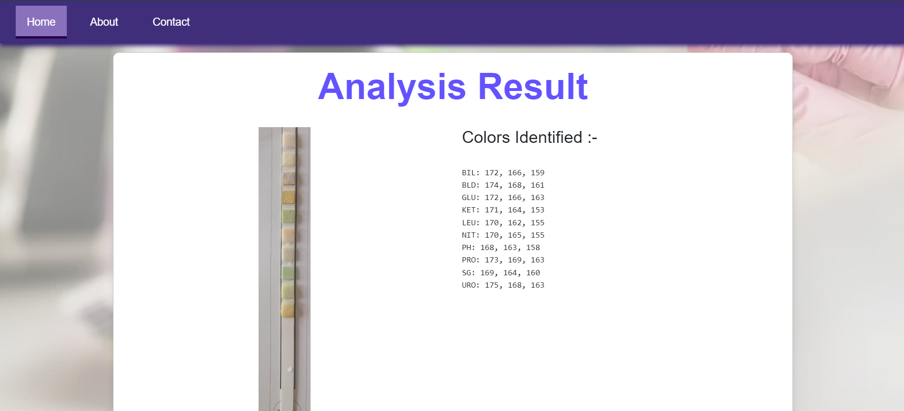

# Urinalysis Color Identification

This full-stack application analyzes urine test strips to identify and quantify **10** distinct color parameters. By processing images of urine dipsticks, it outputs color values for each parameter - **URO, BIL, KET, BLD, PRO, NIT, LEU, GLU, SG, PH**.
Designed for medical applications, this innovative solution aids in accurate diagnosis of various health conditions, enhancing the efficiency of routine analysis in healthcare settings.

## Tech Stack 

  Client - 
  
      
  
  Server- 
  
   

## Getting Started

### 1) Clone the repository

    git clone https://github.com/Tishachhabra/Image-colors-Identification.git

### 3) Navigate to the project directory

  Windows (cmd) :
  
    cd path\to\Image-colors-Identification
    
  macOS/Linux :
  
    cd path/to/Image-colors-Identification

### 3) Run the Flask application
    
    python app.py

Alternatively, run app.py directly via VS Code.

### 4) On loading the home page will be shown in your default browser.

### 5)Upload an image via drag-drop or by browsing. 
( Find images <a href="./images/Samples" target="_blank"> here </a>if you need good quality images to test)

### 6) Click the 'Process' button underneath to get results
### 7) View the analyzed colors from the image.

